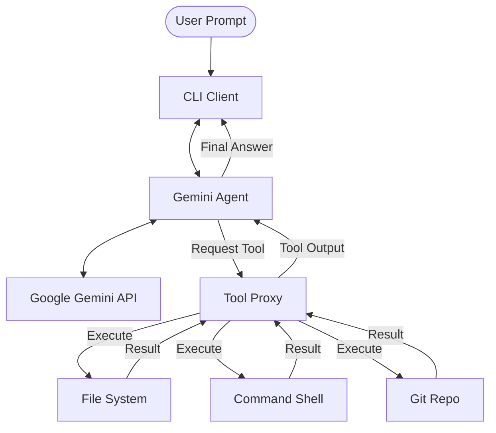

<div align="center">
  <h1>Local Mind</h1>
  <p><strong>Autonomous local AI coding assistant powered by Gemini 2.5 Flash-Lite</strong></p>
  <p>
    
    
    
    
  </p>
</div>

---

## What is Local Mind?

**Local Mind** is a local AI coding assistant that brings the power of Google's **Gemini 2.5 Flash-Lite** directly to your machine. Unlike assistants that rely on complex cloud-local hybrids, Local Mind uses a local-first architecture:
- **Local-First Architecture**: AI reasoning and tool execution both happen on your local machine.
- **Gemini 2.5 Flash-Lite**: Uses Google's latest high-speed, high-reasoning model for coding intelligence.
- **Autonomous Loops**: The agent can plan, execute tools, observe results, and self-correct across multiple steps (up to 10 by default).
- **Secure Sandbox**: Support for sandboxed code execution via Riza for safe testing of complex logic.
- **Beautiful CLI**: Real-time streaming, tool execution status indicators, and full markdown rendering.

---

## Architecture

Local Mind follows a clear, modular architecture designed for local execution:



1.  **CLI Client** (`cli.js`): Manages the interactive session, user input, and formatted output.
2.  **Gemini Agent** (`src/lib/gemini-agent.ts`): The "brain" that communicates with the Google AI SDK and manages the tool-calling loop.
3.  **Tool Proxy** (`cli/tool-proxy.ts`): The execution layer that safely bridges the agent's requests to your local OS operations.

---

## Project Structure

```text
├── cli.js                # Main entry point for the CLI
├── package.json          # Node.js dependencies and scripts
├── tsconfig.json          # TypeScript configuration
├── cli/
│   ├── setup-command.ts  # Implementation of 'npm run setup'
│   └── tool-proxy.ts     # Implementation of all local tool logic
├── src/
│   └── lib/
│       ├── gemini-agent.ts      # AI integration and tool definitions
│       └── session-manager.ts   # Session persistence logic
├── tools/
│   └── interface.ts      # Shared tool schemas and interfaces
└── scripts/
    └── install.sh        # Legacy installation helper
```

---

## Features

- **High Performance**: Leverages Gemini 2.5 Flash-Lite for rapid reasoning and responses.
- **Privacy First**: Your code stays on your machine. Only the prompt and specific file context needed for reasoning are sent to the Gemini API.
- **Full Toolset**:
    - **File Management**: Read, write, list directories, and move/delete files.
    - **Advanced Search**: Cross-platform recursive `grep_search` and `find_files` implementations.
    - **Shell Execution**: Run build tools, tests, and scripts directly from the chat.
    - **Git Integration**: View beautiful diffs, staged changes, and manage repository state.
- **Modern CLI**: Features real-time streaming, syntax highlighting, and interactive "Slash Commands".
- **Project Context**: Automatically analyzes project structure, suggested commands, and current goals.

---

## Available Tools

The agent can utilize the following capabilities autonomously:

| Tool Group | Actions | Description |
|------------|---------|-------------|
| **File System** | `read_file`, `write_file`, `delete_file`, `create_directory` | Full manipulation of your project files. |
| **Discovery** | `list_directory`, `find_files`, `grep_search` | Native recursive search and structural analysis. |
| **Shell** | `run_command` | Execute any allowed build, test, or system command. |
| **Version Control** | `git_diff`, `diff_files` | Analyze changes and manage repository state. |
| **Context** | `set_work_context`, `get_work_context` | Maintain state and goals across multi-turn tasks. |
| **Sandbox** | `execute_code` | Run Python/JS logic in a secure Riza sandbox. |

---

## Getting Started

### 1. Prerequisites
- **Node.js**: v22.x or later.
- **Gemini API Key**: Get one for free at [Google AI Studio](https://aistudio.google.com/).

### 2. Installation
Clone the repository from GitHub and install the necessary dependencies:
```bash
# Clone the repository
git clone https://github.com/samolubukun/Local-Mind.git

# Enter the project directory
cd Local-Mind

# Install dependencies
npm install
```

### 3. Setup & Global Alias
Run the interactive setup wizard to configure your environment and create a global command:
```bash
npm run setup
```
This will:
- Prompt for your **GEMINI_API_KEY**.
- Create your local `.env` configuration.
- Initialize your data directory in `~/.local-mind`.
- **Create a global `localmind` command** (allows you to use the assistant in any project).

---

## Usage

### Interactive Mode (Recommended)
Launch the full interactive chat experience:
```bash
localmind -i
# or
npm start
```

### Single Command Mode
Quickly ask the agent to do something from your terminal:
```bash
localmind "Fix the TypeScript errors in src/utils.ts"
```

### Real-World Workflow: Using Local Mind Anywhere

Once you have completed the **Setup** phase, you can use Local Mind to help you code in any repository on your computer.

#### 1. Navigate to your target project
```bash
cd C:\Users\USER\Desktop\my-react-app
```

#### 2. Launch Local Mind
```bash
# Start an interactive session
localmind -i

# OR ask a quick question
localmind "Add a Tailwind navbar to App.tsx"
```

#### 3. How it works
The `localmind` command is globally available. When executed, it automatically detects your current terminal's directory and treats it as the "Workspace". The AI agent will then be able to:
- **Index** your project structure.
- **Search** through your specific files.
- **Run** your project's npm scripts or build commands.
- **Modify** your project code directly.

The agent is fully aware of its surroundings, so you can simply say "Refactor the styles in this project" and it will find the correct files for you.

---

## Slash Commands
Inside the interactive CLI, type `/` to access built-in commands:
- `/help`: Show available commands and instructions.
- `/context`: Display the current AI "Work Context" (goal, status).
- `/goal`: Set or update the current high-level mission for the agent.
- `/diff`: Show a beautifully formatted git diff of your changes.
- `/diff-save`: Save large diffs to a file for review.
- `/clear`: Clear the terminal screen.
- `/session`: Start a fresh conversation session.
- `/quit`: Exit the assistant.

---

## Configuration
Environment variables (stored in `.env`):
- `GEMINI_API_KEY`: Your Google AI SDK key.
- `MODEL_ID`: Default is `gemini-2.5-flash-lite`.
- `RIZA_API_KEY`: (Optional) For secure sandboxed code execution.

---

## Security
Local Mind executes tools based on AI reasoning. While it is local, it has the ability to modify files and run shell commands. 
- **Recommendation**: Always run Local Mind in projects where you are comfortable with automated tool execution.
- **Sandboxing**: For high-security tasks, you can provide a `RIZA_API_KEY` to run logic in a secure sandbox.

---

Built for a faster, smarter, and local-first coding future.
